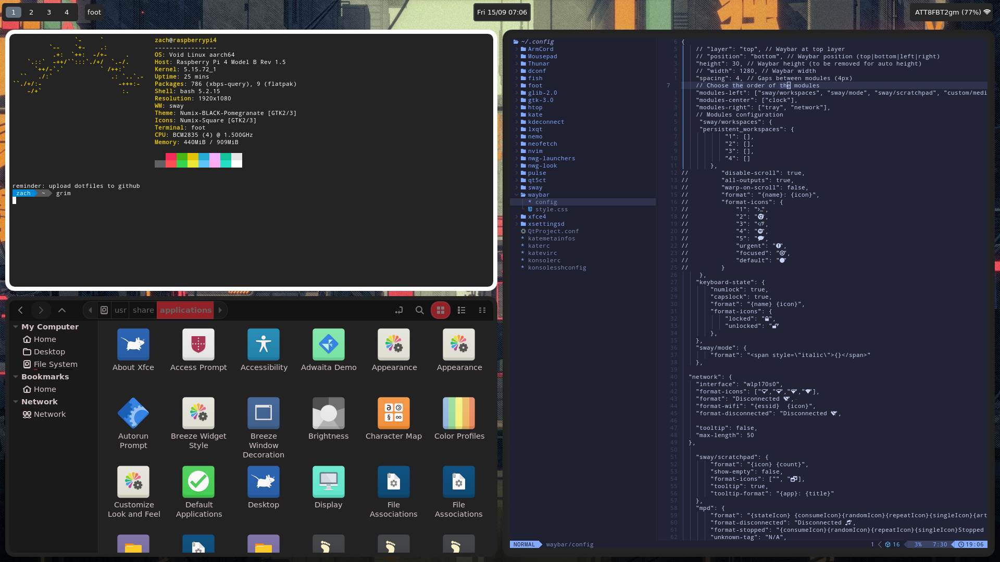

# Void Linux SwayFX Dotfiles

This is my SwayFX Dotfiles for Void Linux for my Raspberry Pi. Feel free to use them and tweak them to how ever you want!

document.md


## Dependencies
NOTE: The following package list is for Void Linux aarch64 and might be difierent for other Linux Distributions. 
```
sudo xbps-install -Sy swayfx xfce4 nemo neovim nwg-launchers bash qt5ct htop waybar grim foot kdeconnect
```

***Enjoy!***
